# AWS 3-Tier Architecture

## 📌 Project Overview
The AWS 3-Tier Architecture project demonstrates the deployment of a **highly available and scalable web application** using Amazon Web Services (AWS).

The architecture follows the 3-tier model:

- **Web Tier (Presentation Layer)** – Serves the static frontend via Nginx and integrates with the application layer.  
- **Application Tier (Logic Layer)** – Node.js application handling API logic and database interactions.  
- **Database Tier (Data Layer)** – Amazon Aurora MySQL cluster for persistent storage.
  
  

The setup ensures **high availability, scalability, security, and HTTPS access** through AWS CloudFront and ACM.

---

## 🛠 Services Used
1. Amazon S3  
2. AWS Identity and Access Management (IAM)  
3. Amazon VPC  
4. Amazon EC2  
5. Amazon CloudFront  
6. Amazon Route 53  
7. AWS Certificate Manager (ACM)  
8. Amazon Simple Notification Service (SNS)  
9. Amazon RDS (Aurora MySQL)  
10. AWS Web Application Firewall (WAF)  

---

## ⚙️ Part 0: Setup

### 0.1 Download Code from GitHub
```bash
git clone https://github.com/aws-samples/aws-three-tier-web-architecture-workshop.git
```
This repository contains the web-tier, app-tier, and nginx.conf configuration.

0.2 SNS Setup

Create a Standard Topic in Amazon SNS.

Add a subscription (e.g., Email).

Confirm the subscription via email.
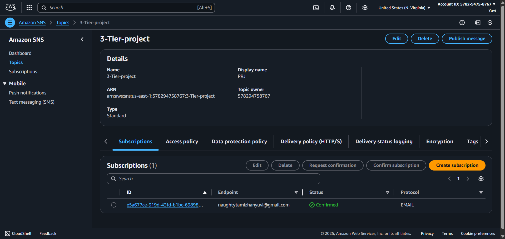


0.3 S3 Bucket Creation

Create an S3 bucket.

Upload:

web-tier directory

app-tier directory

nginx.conf file
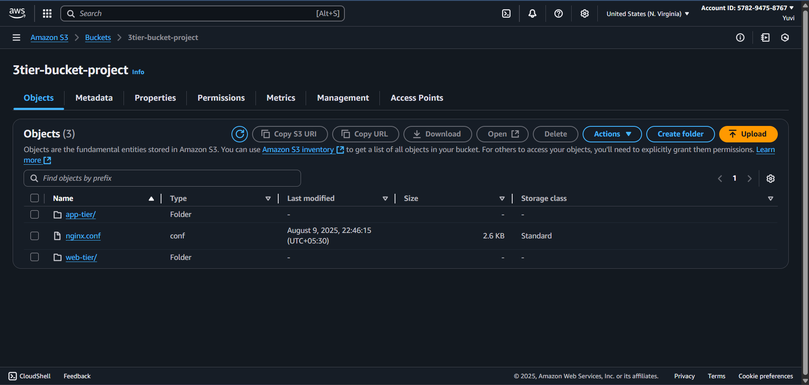


0.4 IAM Role Creation

Create an IAM role for EC2 with the following policies:
```bash
AmazonS3ReadOnlyAccess

AmazonSSMManagedInstanceCore
```
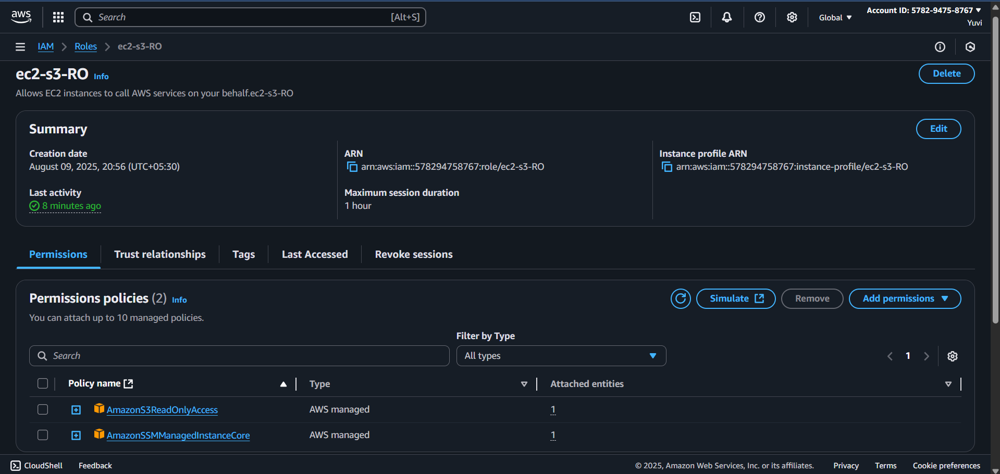


🌐 Part 1: Networking and Security
1.1 VPC and Subnets

Create a VPC.

Create:

2 Public Web Subnets (internet-facing resources)

2 Private App Subnets

2 Private DB Subnets
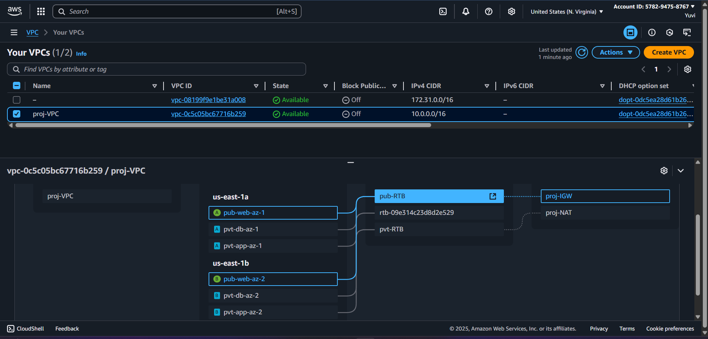


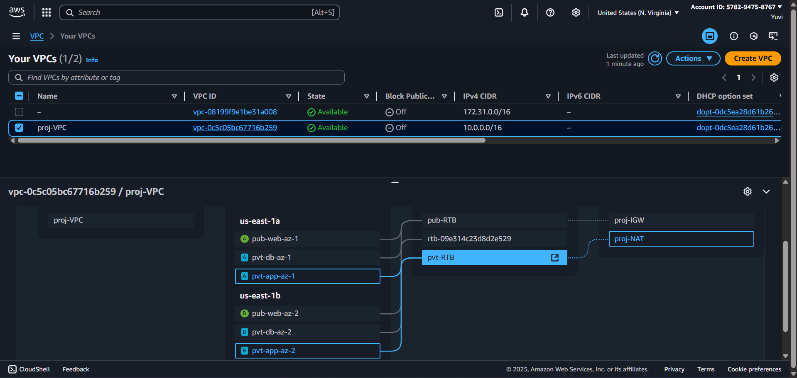


1.2 Internet Connectivity

Create an Internet Gateway (IGW) and attach it to the VPC.

Create a Public Route Table:

Associate with Public Web Subnets.

Add route 0.0.0.0/0 → Internet Gateway.
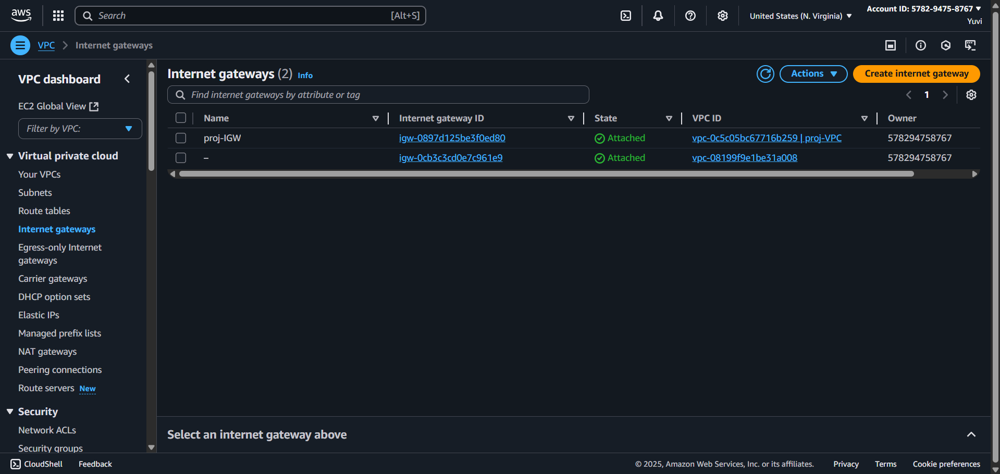


Create a NAT Gateway in one of the public subnets.

Create a Private Route Table:

Associate with Private App Subnets.

Add route 0.0.0.0/0 → NAT Gateway.
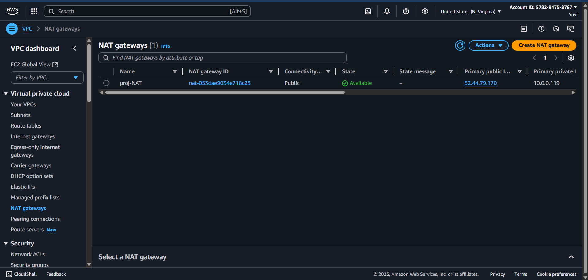


1.3 Security Groups

Create 5 Security Groups:

Security Group	Rules
Internet-Facing SG	HTTP (80) → My IP, HTTPS (443) → 0.0.0.0/0
Web-Tier SG	HTTP (80) → My IP, HTTP (80) → Internet-Facing SG
Internal SG	HTTP (80) → Web-Tier SG
App-Tier SG	TCP 4000 → My IP, TCP 4000 → Internal SG
DB SG	MySQL/Aurora (3306) → App-Tier SG
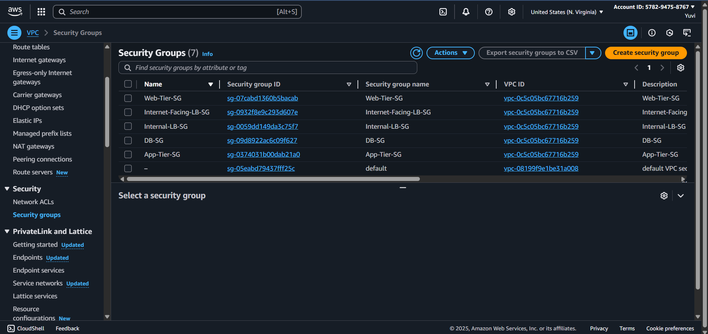


🗄️ Part 2: Database Deployment
2.1 Subnet Group

Create an RDS Subnet Group using both private DB subnets.
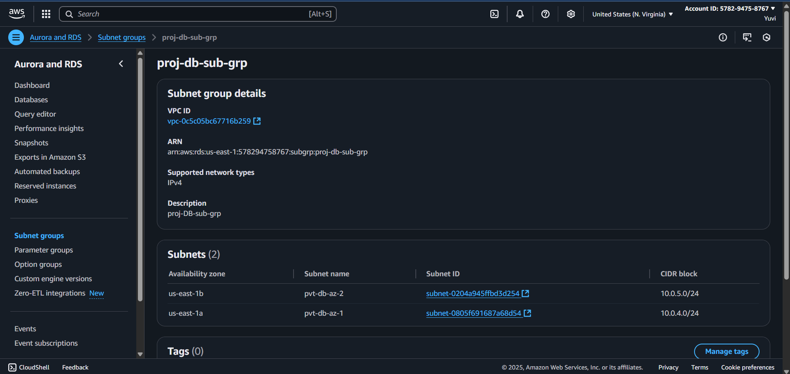


2.2 Database Deployment

Create an Amazon Aurora MySQL database in Dev/Test mode.

Enable Multi-AZ deployment (Aurora Read Replica).
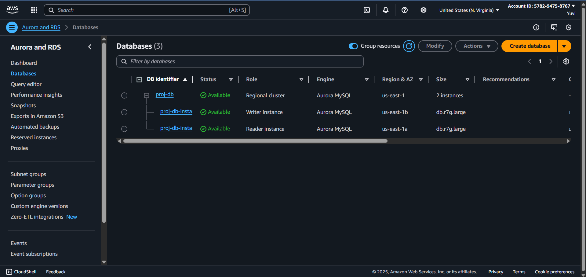


💻 Part 3: App Tier Instance Deployment
3.1 Launch App Instance

Private App Subnet

No public IP

No key pair

Attach IAM Role from Part 0.4
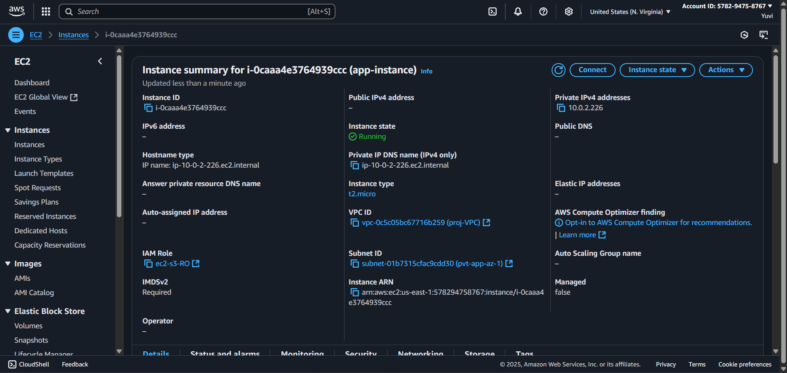


3.2 Configure Database

Connect via AWS Systems Manager Session Manager.

Install MySQL client:

sudo yum install mariadb105 -y


Connect to RDS:
```bash
mysql -h RDS-ENDPOINT -u USERNAME -p
```
```bash
Create database and table:
```

```bash
CREATE DATABASE webappdb;
USE webappdb;
CREATE TABLE IF NOT EXISTS transactions (
    id INT NOT NULL AUTO_INCREMENT,
    amount DECIMAL(10,2),
    description VARCHAR(100),
    PRIMARY KEY(id)
);
```

```bash
INSERT INTO transactions (amount, description) VALUES ('400', 'groceries');
SELECT * FROM transactions;
```
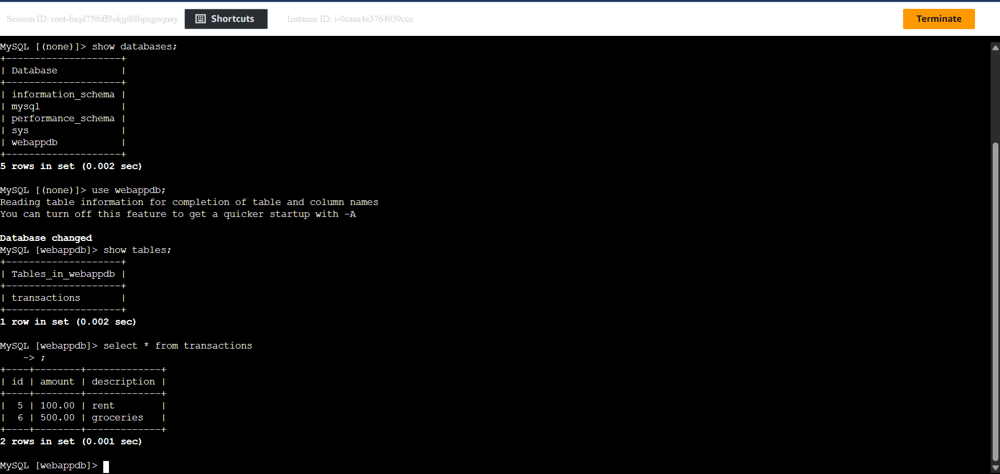


3.3 Configure App Instance
# Install Node Version Manager
```bash
curl -o- https://raw.githubusercontent.com/nvm-sh/nvm/v0.38.0/install.sh | bash
source ~/.bashrc
```

# Install PM2
```bash
npm install -g pm2
```
# Download app-tier code
```bash
aws s3 cp s3://BUCKET_NAME/app-tier/ ~/app-tier --recursive
cd ~/app-tier
```

# Update Dbconfig.js with RDS credentials4
```bash
sudo vi Dbconfig.js
```
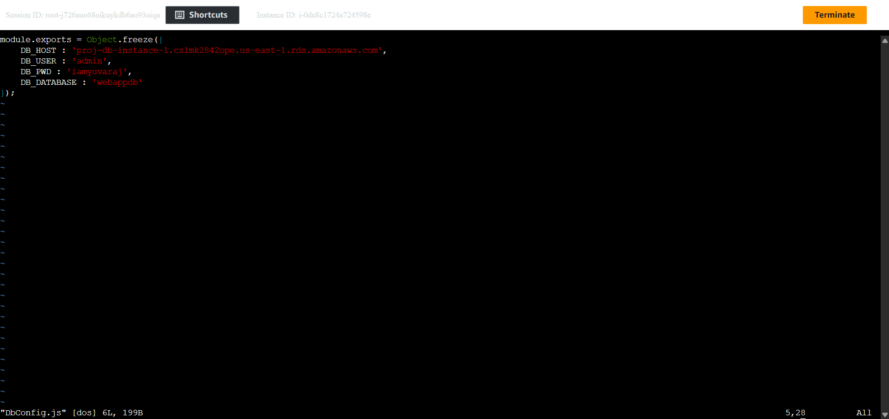


```bash
# Install dependencies
npm install
```

# Start app
```bash
pm2 start index.js
pm2 startup
pm2 save
```
3.4 Test App Tier
```bash
curl http://localhost:4000/health
curl http://localhost:4000/transaction
```
⚖️ Part 4: Internal Load Balancing and Auto Scaling

Create App AMI – Create an AMI (app-img) from configured App Instance.

Launch Template – Create Launch Template (app-temp).

Target Group – Port 4000, Health check /health.

Internal Load Balancer – Application Load Balancer (internal-facing, port 80).

Auto Scaling Group – Desired/Min/Max: 2, attach app-tg, enable SNS notifications.

🌍 Part 5: Web Tier Instance Deployment

Launch Web Instance – Public subnet, public IP, attach IAM role.

Configure Web Instance

# Install Node.js
```bash
curl -o- https://raw.githubusercontent.com/nvm-sh/nvm/v0.38.0/install.sh | bash
source ~/.bashrc
nvm install 16
nvm use 16
```

# Download web-tier code
```bash
aws s3 cp s3://BUCKET_NAME/web-tier/ ~/web-tier --recursive
cd ~/web-tier
npm install
npm run build
```
# Install & configure Nginx
```bash
sudo yum install nginx -y
cd /etc/nginx
sudo rm nginx.conf
sudo aws s3 cp s3://BUCKET_NAME/nginx.conf ./nginx.conf
```
# Update proxy_pass with Internal ALB DNS
```bash
sudo vi nginx.conf
```
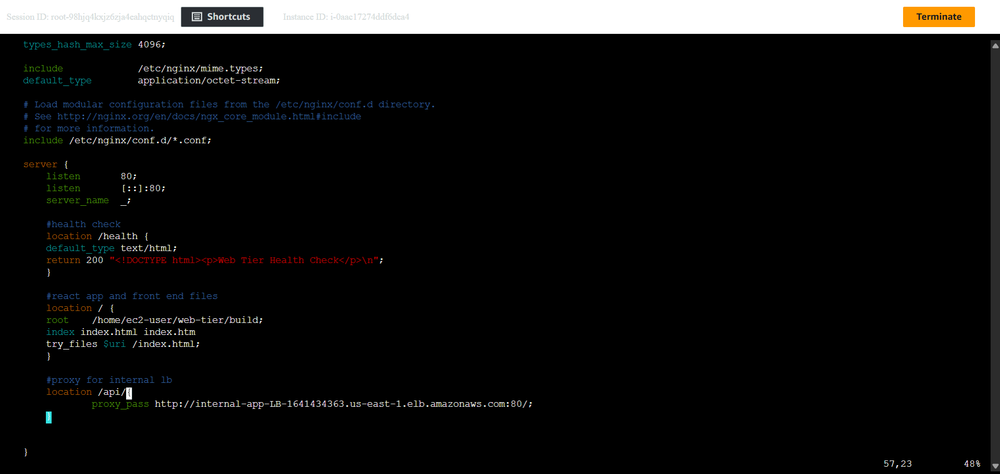
```bash
chmod -R 755 /home/ec2-user
sudo chkconfig nginx on
sudo systemctl start nginx
```
🌐 Part 6: External Load Balancer and Auto Scaling

Create Web AMI – From Web Instance.

Launch Template – Create (web-temp).

Target Group – Port 80, health check /health.

Internet-Facing Load Balancer – ALB (web-lb) with listener on port 80.

Auto Scaling Group – Desired/Min/Max: 2, enable SNS notifications.

🔒 Part 7: Domain, SSL, and CDN Integration

CloudFront – Distribution with web-lb as origin, enable WAF.
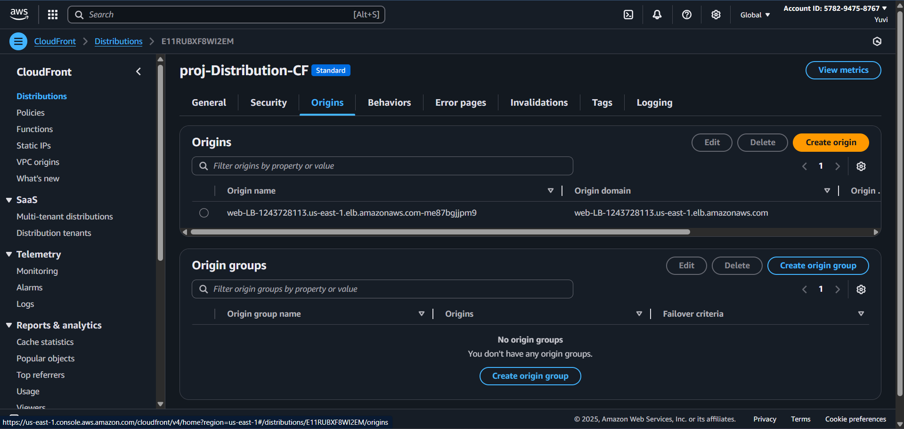


Route 53 – Hosted zone for your domain.
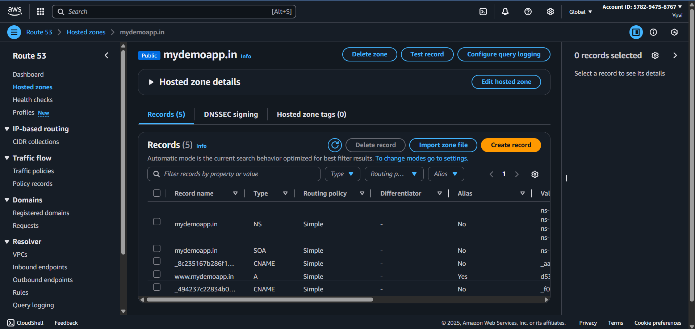


SSL Certificate (ACM) – Request certificate for domain (DNS validation).
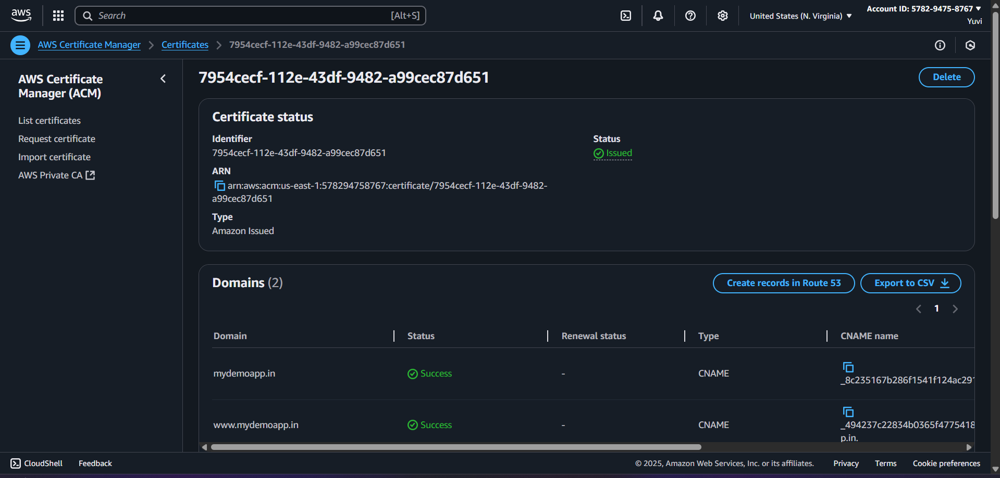


Final DNS Setup – Route 53 A record alias → CloudFront distribution.
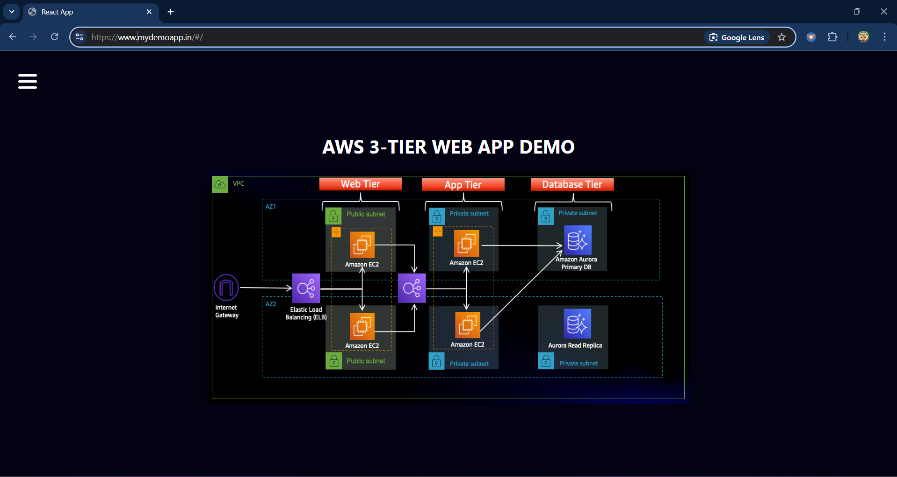


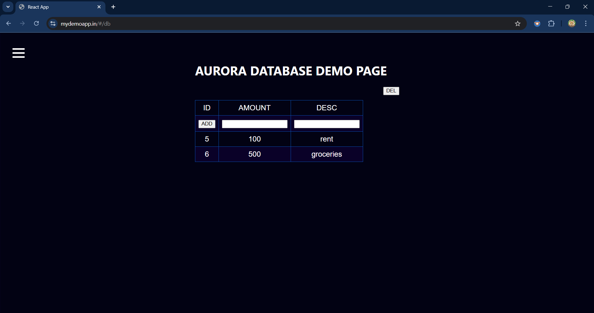

